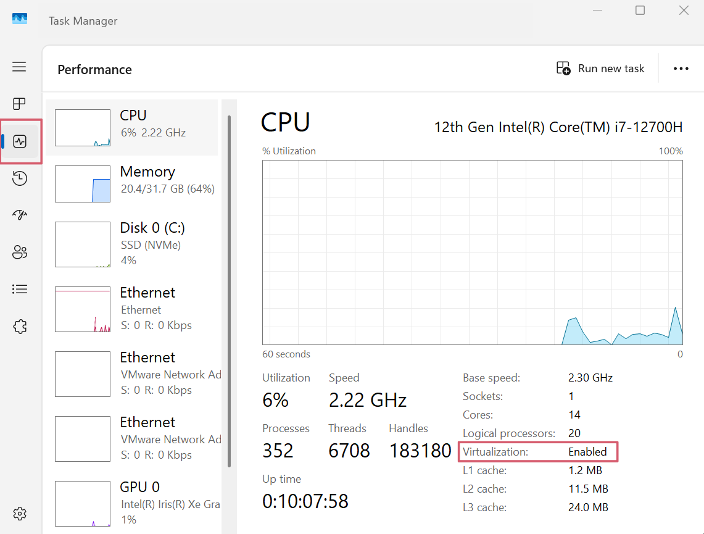
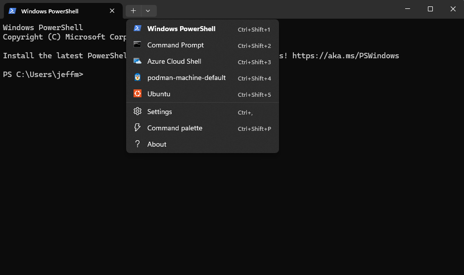

# Installing WSL, VMWare and Docker together

Let’s go step-by-step to ensure **Docker Desktop**, **VMware**, and **WSL2** all work together without conflicts.

**NOTE: WSL and Docker are required.**  VMWare is optional if you want to use VMWare workstation for a full contained Windows, Linux or Mac environment on your PC.

---

## 1. Understanding the Root Conflict

Docker Desktop on Windows requires **a virtualization backend**.
You have two primary choices:

| Docker Backend               | Virtualization Layer                              | Compatible With VMware?                                                                        | Notes                                 |
| ---------------------------- | ------------------------------------------------- | ---------------------------------------------------------------------------------------------- | ------------------------------------- |
| **WSL2 backend (default)**   | Microsoft Hyper-V platform (lightweight via WSL2) | **Yes**, if VMware Workstation is configured for **Windows Hypervisor Platform (WHP)** support | Best for modern setups                |
| **Hyper-V backend (legacy)** | Full Hyper-V hypervisor                           | **No** – Hyper-V takes exclusive control of VT-x                                               | Avoid if you need VMware concurrently |

So, the **key** is to **use Docker’s WSL2 backend**, and configure **VMware Workstation** to use **WHP** instead of trying to compete for the hypervisor.

---

## 2. Correct Installation Flow (2025-ready version)

### Step 1: Insure Virtualization is enabled

1. Open Task Manager (Ctrl + Alt + Del)
2. Select the CPU Tab and insure `Virtualization` is `Enabled`
3. **If not**, then google how to enable it in your bios.

    

### Step 2: Install or Update WSL2

Make sure you’re running the **latest WSL** (it now includes systemd and GPU acceleration).  This step sets up WSL but does not install and Linux distribution.

```powershell
wsl --install
wsl --set-default-version 2
```

(Optional) This step will install Ubuntu as your default Linux distro:

```powershell
wsl --install -d Ubuntu
```

#### Step 2A: Open WSL in Windows Terminal

To access your WSL environment through a Terminal Window.

1. Close [Windows Terminal](windows-terminal.md) if open
2. Open [Windows Terminal](windows-terminal.md) - This will allow Windows Terminal to see the new WSL distro
3. Select the pulldown on the top bar and select `Unbuntu`

    

#### Setup 2B: Shutdown all WSL distributions

If you are not using WSL, you may want to shutdown all distributions.  This will include Ubuntu and Docker.

```
wsl --shutdown
```

To see which distributions are running

```
wsl -l -v
```

**For more info see:  our [wsl](wsl) section** with more description and a cheatsheet.

---

### Step 3: Install **Docker Desktop for Windows**

* Download the latest stable build:
  👉 [https://www.docker.com/products/docker-desktop/](https://www.docker.com/products/docker-desktop/)

* During installation:

  * ✅ Choose **“Use the WSL 2 based engine”**
  * ❌ Do **not** enable the “Hyper-V backend” option.
  * ✅ Allow integration with your chosen distro (e.g., Ubuntu).

After install, verify with:

```bash
wsl --list --verbose
docker version
```

Your default distro should show `VERSION = 2`.

---

### Step 4: (Optional) Configure VMware for WHP Compatibility

If you use **VMware Workstation 16.2+** or **VMware Player 16.2+**, you can enable compatibility with Hyper-V / WSL2.

#### In VMware:

1. Open **Preferences → General → Compatibility**
2. Check ✅ **“Enable Windows Hypervisor Platform”**

#### Or in `config.ini` (if missing):

Add this line:

```
vmx.allowNested = "TRUE"
hypervisor.cpuid.v0 = "FALSE"
```

This tells VMware to use Microsoft’s **Hypervisor Platform API (WHP)** instead of direct VT-x, allowing coexistence with WSL2.

> ⚠️ Performance will be ~5-10% slower inside VMware VMs under WHP, but both Docker (via WSL2) and VMware can now run simultaneously.

---

## 3. Validate All Layers

### Check Docker engine:

```bash
docker run hello-world
```

### Check WSL2 kernel:

```bash
wsl --status
```

### Check VMware still runs:

Boot a VM and confirm it starts normally.

---

## 4. Optional Optimizations

| Area               | Setting                                           | Purpose                                                      |
| ------------------ | ------------------------------------------------- | ------------------------------------------------------------ |
| **WSL config**     | `~/.wslconfig`                                    | Limit RAM/CPU usage (Docker + WSL2 share the same resources) |
| **Example**        | `[wsl2] memory=8GB processors=4`                  | Keeps Docker light                                           |
| **Docker Desktop** | Settings → Resources                              | Adjust memory/CPU manually if needed                         |
| **Networking**     | Use `host.docker.internal` instead of `localhost` | Smooth cross-VM and Windows/WSL communication                |

---

## 5. Summary of the Recommended Setup

✅ Use **Docker Desktop with WSL2 backend**
✅ Enable **Windows Hypervisor Platform**
✅ Configure **VMware for WHP support**
✅ Avoid enabling full **Hyper-V backend**
✅ Optionally tune WSL2 resources for stability

---

## 6. Bonus: CLI-Only Docker (if you dislike Docker Desktop)

If you prefer a lightweight dev setup, you can run Docker Engine directly inside WSL2 Ubuntu:

```bash
sudo apt install docker-ce docker-ce-cli containerd.io
sudo usermod -aG docker $USER
```

Then enable it on startup via `systemd`.
This avoids Docker Desktop entirely and plays perfectly with VMware.

---

Would you like me to outline **the `.wslconfig` file and performance-tuning options** next (so Docker and VMware can share CPU/memory efficiently)?
